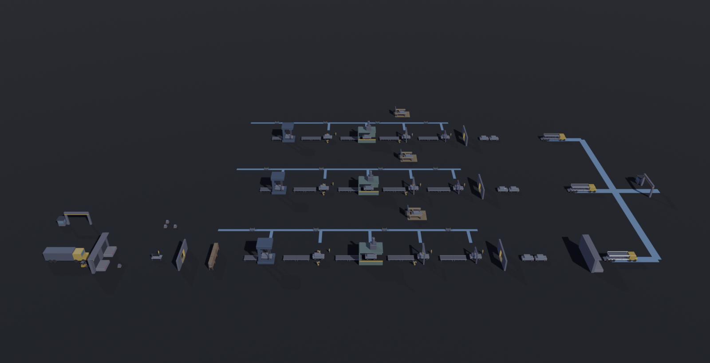
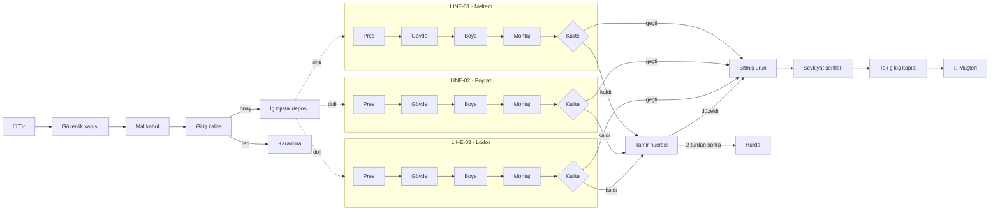
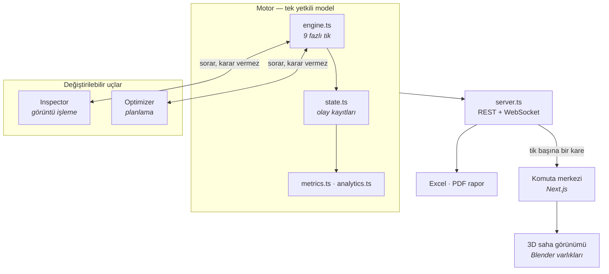

<div align="center">

# KOÇ OTOMOTİV — Fabrika Komuta Merkezi

**Üç üretim hattı, tek gerçek.** Malzemenin kapıdan girişinden aracın müşteriye
teslimine kadar bütün akışı dakika dakika işleten, deterministik bir dijital ikiz.



</div>

<div align="center">

|    Motor     |   Arayüz    |             Kapılar             |
| :----------: | :---------: | :-----------------------------: |
| **171 test** | **68 test** | tsc · eslint · prettier · build |

TypeScript · Node · Next.js 16 · React Three Fiber · Blender

</div>

---

## Ne yapıyor?

Bir fabrikanın **bir vardiyasını** dakika dakika işletir ve o vardiyanın neden
öyle geçtiğini anlatır.

|                      |                                                                                                                                     |
| -------------------- | ----------------------------------------------------------------------------------------------------------------------------------- |
| **Üç hat, üç model** | LINE-01 _Meltem_, LINE-02 _Poyraz_, LINE-03 _Lodos_. Üçü de aynı mantıkla çalışır; fark üzerlerinden geçen araçtır.                 |
| **Uçtan uca akış**   | Tır → güvenlik kapısı → mal kabul → giriş kalite → depo → pres, gövde, boya, montaj, kalite → tamir/hurda → bitmiş ürün → sevkiyat. |
| **Deterministik**    | Aynı tohum, aynı senaryo, aynı koşu. Bir bulguyu tartışmak istiyorsanız tohumu verin, aynı fabrikayı görürüz.                       |
| **3D saha görünümü** | Sahnedeki her nesnenin motorda bir karşılığı var. Süs yok: bir forklift varsa bir tır boşaltılıyordur.                              |
| **Kendini açıklar**  | Panodaki her sayı bir olaydan gelir; asistan yalnızca o koşunun verisinden cevap verir.                                             |

---

## Akış



Bir tik bir dakikadır. 480 tiklik vardiya sekiz saat, hat başına 8 dakikalık
takt ise araç başına sekiz dakika demektir.

---

## Mimari



Arayüzün kendine ait fabrika durumu **yoktur**. Motor durduğunda son kareyi
güncelmiş gibi göstermez, bağlantının koptuğunu söyler.

---

## Hızlı başlangıç

İki süreç: motor ve onu okuyan komuta merkezi.

```bash
npm install
npm run server
```

```bash
cd web && npm install && npm run dev
```

<http://localhost:3000> — senaryo seçin, **Çalıştır**'a basın.
3D için sağ üstteki **Saha Görünümü**.

### Arayüzsüz koşu

```bash
npm run scenario                            # temel koşu, 240 dakika
npm run scenario -- quality_failure         # tek bozulma
npm run scenario -- --compare --ticks=300   # bütün senaryolar, tabana karşı
npm run report                              # Excel + PDF vardiya raporu
npm run optimize                            # planlama politikalarını karşılaştır
```

Senaryolar: `normal`, `machine_failure`, `material_shortage`, `quality_failure`,
`demand_surge`, `line_stop`.

### Kalite kapıları

```bash
npm run typecheck && npm run lint && npm run format:check && npm test
cd web && npm run typecheck && npm run lint && npm test && npm run build
```

### 3D varlıkları

Modeller `tools/models/build_assets.py` içinde **kod olarak** duruyor. `.glb`
dosyaları depoda olduğu için projeyi çalıştırmak Blender gerektirmez; yalnızca
modeli değiştirecekseniz gerekir.

```bash
npm run models     # varlıkları Blender ile üret
npm run preview    # yerleşimi docs/onizleme.png olarak render et
```

---

## Neyi doğruluyoruz?

Testler "kod çalışıyor mu" değil, **"fabrika tutarlı mı"** diye sorar.

| Kural                                                 | Neden                                                                                             |
| ----------------------------------------------------- | ------------------------------------------------------------------------------------------------- |
| Her makinenin zaman defteri geçen süreye **tam** eşit | Çalışma + besleme yok + önü tıkalı + boşta + duruş toplamı elapsed'i aşarsa her kayıp oranı şişer |
| Bir araç aynı anda iki yerde olamaz                   | Kuyruk, makine ve sevkiyat aynı aracı paylaşamaz                                                  |
| Tüketilen her parti alınan bir partiye kadar izlenir  | İzlenebilirlik zinciri kopmamalı                                                                  |
| Karantinadaki parti hatta hiç verilmez                | Kalite kararı sonuç doğurmalı                                                                     |
| Son kalite kapısını geçmeyen araç sevk edilemez       | Kapı gerçekten kapı olmalı                                                                        |
| Hat tavanı **hat başına** sayılır                     | Bir hattın dolu olması diğerinin işini engellemez                                                 |
| Ekranda İngilizce kelime yok                          | Motor koşturulup üretilen metin denetlenir; grep yakalayamaz                                      |
| İstasyon adı ile kimliği aynı numarayı söyler         | Panonun iki farklı numara vermesi sahada telsizde karışıklık üretir                               |

Bulgular **tek tohumla** kabul edilmez. Bir politika ölçülüp reddedildiyse
gerekçesi `docs/IMPLEMENTATION_PLAN.md` içinde yazılıdır ve bir test o gerekçenin
eskimesini yüksek sesle bildirir — nitekim tesis üç hatta çıkınca bir gerekçe
gerçekten eskidi ve test onu yakaladı.

---

## Tasarım kararları

| Karar                            | Gerekçe                                                                                              |
| -------------------------------- | ---------------------------------------------------------------------------------------------------- |
| **Türkçe, saha dili**            | Ekranı okuyan kişi vardiya amiri. "Besleme Yok", "Önü Tıkalı", "Hattı Tutuyor".                      |
| **Andon: Dur, Haber Ver, Bekle** | Duruş nerede izleniyorsa orada görünür. Kapatma düğmesi yok — duruşu onaylamak sahada yapılan iştir. |
| **Renk yalnızca durum taşır**    | Yüzeyler grafit; yeşil/sarı/turuncu/kırmızı/mavi operasyonel anlamdadır ve seyreltilmez.             |
| **Motor sorar, karar vermez**    | `Inspector` ve `Optimizer` birer uç. Teklif edilmemiş bir planı motor yok sayar.                     |
| **Plan birimi metre**            | Modeller gerçek boyutlarında; ölçek çarpanıyla değil doğru ölçüyle.                                  |

---

## Yol haritası

- [x] Deterministik motor, olay kaynaklı durum, 9 fazlı tik
- [x] REST + WebSocket host, komuta merkezi, Excel/PDF rapor
- [x] Görüntü işleme ucu, veri kümesi üretimi, planlama ucu
- [x] Blender varlıkları, 3D saha görünümü, üç üretim hattı
- [ ] Eğitilmiş kusur tespit modeli — `ServiceInspector` hazır, arkasında henüz servis yok

> Model bağlanana kadar ekranda görülen kusur tespiti **simülasyondur**, model
> çıktısı değildir. Bu ayrım bilerek korunuyor.

---

## Belgeler

| Dosya                                                        | İçerik                                                                 |
| ------------------------------------------------------------ | ---------------------------------------------------------------------- |
| [`docs/DEVAM.md`](docs/DEVAM.md)                             | Kaldığımız yer; sıfırdan bakan biri soru sormadan devam edebilsin diye |
| [`docs/IMPLEMENTATION_PLAN.md`](docs/IMPLEMENTATION_PLAN.md) | Ne denendi, ne ölçüldü, ne reddedildi                                  |
| [`docs/TERMINOLOGY.md`](docs/TERMINOLOGY.md)                 | Terim sözlüğü ve her seçimin gerekçesi                                 |
